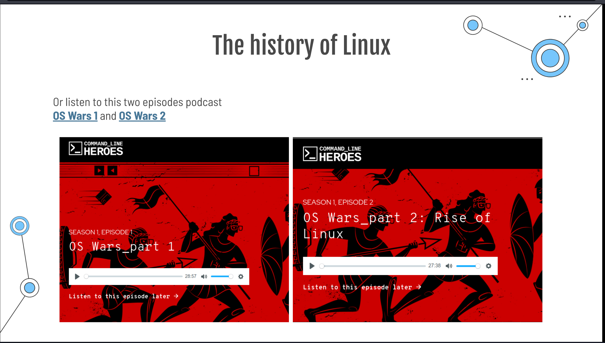
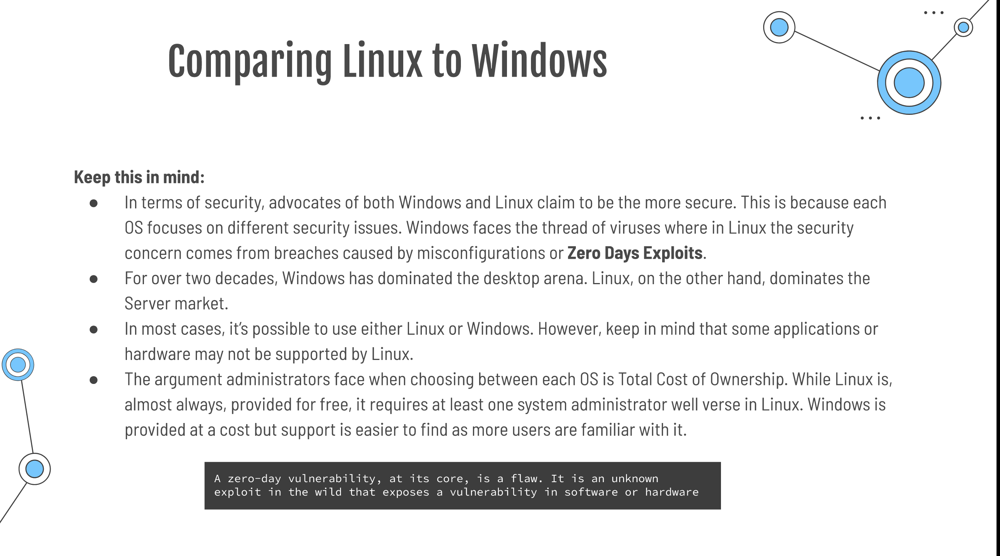
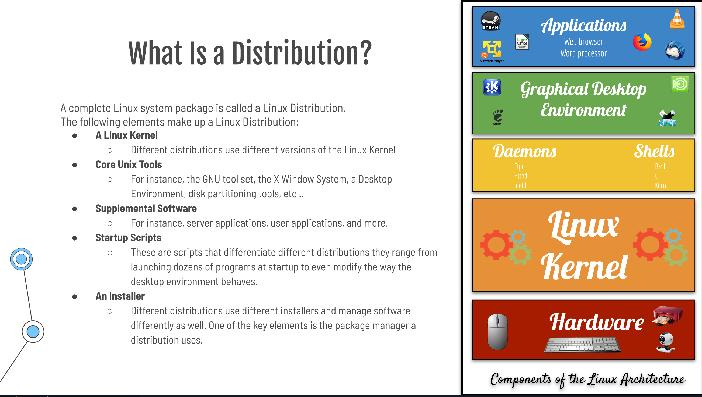
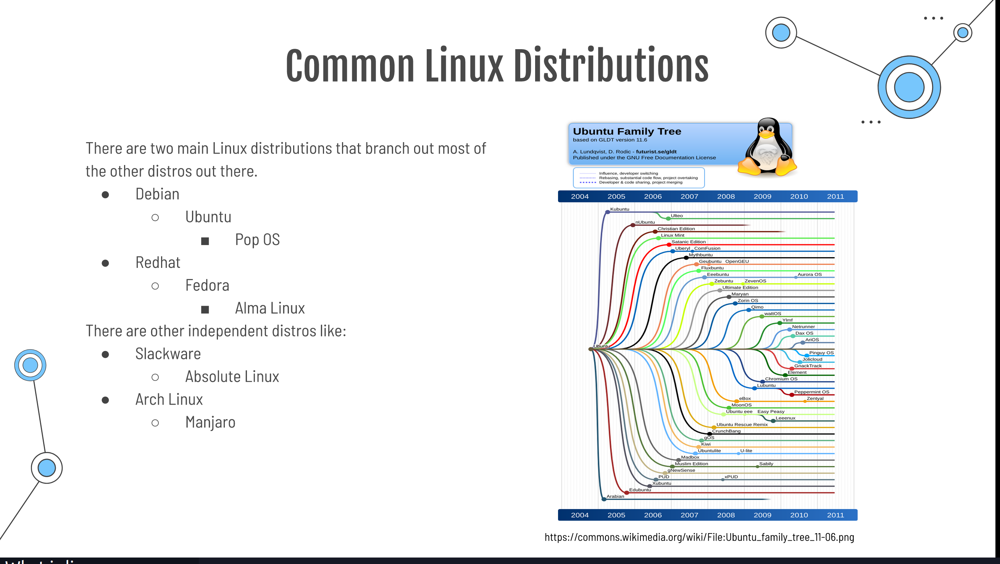
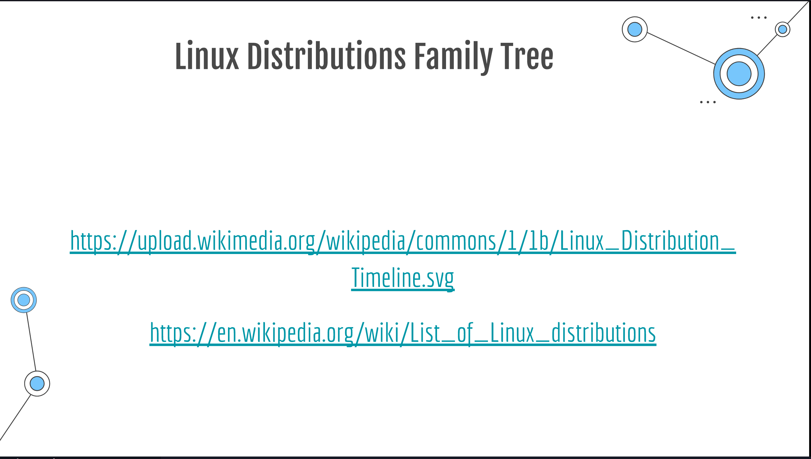

--- 
name : Shaimaa Husien
class: cis 106
semester: spring 2022
---
## Deliverable 1

## Introduction/project description
* how to install a web Apache web sever on Ubuntu 20.04
Apache web server is the most extensively used open sources web server supported on the majority 
of the OS including Linux, windows , etc. It is highly customizable and can be integrated with other 
module . Installing and configuring the Apache for basic setup is quite easy .we will need to update 
the system repository index to install the most recent version.

## Project hardware and software requirements

you should have a regular, non-root user with sudo privileges configured on your server. Additionally, you will need to enable a basic firewall to block non-essential ports. You can learn how to configure a regular user account and set up a firewall for your server 

## What is Linux?
Linux is a Unix like Operating System popular in academic and business environments 
Linux consists of a Kernel Libraries ,and utilities that make up the entire operating system 
is also available in many distributions (any operating system that rand the linux kernel)
popular Linux distributions include Arch,centos ,Debian ,fedora, openSUSE, Red Hat , Slackware , Ubuntu and many more.
## Short history of linux
Not to be confused with Linux kernel version history.
Linux began in 1991 as a personal project by Finnish student Linus Torvalds: to create a new free operating system kernel. The resulting Linux kernel has been marked by constant growth throughout its history. Since the initial release of its source code in 1991, it has grown from a small number of C files under a license prohibiting commercial distribution to the 4.15 version in 2018 with more than 23.3 million lines of source code, not counting comments.

## Linux distribution
there are tow main Linux distributions that branch out most of the other distorts out there 
* Debian
* Ubuntu
* Pop os
* Redhat 
* Fedora
* Alma Linux  

* Slackware 
Slackware aims for design stability and simplicity and to be the most "Unix-like" Linux distribution. It makes as few modifications as possible to software package.

* Debian 
is an all volunteer organization dedicated to developing free software and promoting the ideals of the free
software Community.**  Fedora **
contains software distributed under various free and open-source licenses and aims to be on the leading edge of open   source .   

>  Debian based  Linux Distributions 
> Ubuntu:  
>is a Linux distribution freely available with both community and professional support. 
> Kali Linux: 
>is a Debian-derived Linux distribution designed for digital forensics and penetration testing. It is maintained. 
>The standard Debian and its popular off shoot Ubuntu are great, all-around choices for a Linux system, but if you  have more specialized needs, you might want a Debian alternative
      
* red Hat Inter price Linux
Red Hat Enterprise in Linux provides a concisest foundation environment and thr tools needed to deliver services and workloads faster for any application. it also reduces deployment friction and costs while speeding time to value for crucial workloads enabling development and operations teams to innovator together in any environment.

> Fedora:
>contains software distributed under various free and open-source licenses and aims to be on the leading edge of open  source .

## Open Source VS Closed Source
Open source software refers to the computer software which source is open means the general public can access and use. Closed source software refers to the computer software which source code is closes means public is not given access to the source code

## advantage of open source 
Open Source: the software may be distributed for a free or free. the source code is distributed with the software.

## advantage of close source 
Close Source: the software is not distributed with source code. the user is restricted from modifying the code.

* The Free software movement  
The freeThe free software movement is a social movement with the goal of obtaining and guaranteeing certain freedoms for software users, namely the freedoms to run the software to study the software to modify the software to modify software and to share copies of software whether modified or not software which meet some requirements of freedoms. 

Freedom 0: use the software for any purpose 
Freedom 1: examine the source code and modify it as you see fit
Freedom 2: redistributed the Software 
Freedom 3: redistribute your modified software 
   
## Sources 
class presentation lab 1
https://www.makeuseof.com/best-debian-based-linux-distros/
https://www.google.com/search?channel=fs&client=ubuntu&q=open+source+vs+closed+source
course YouTube channel 
