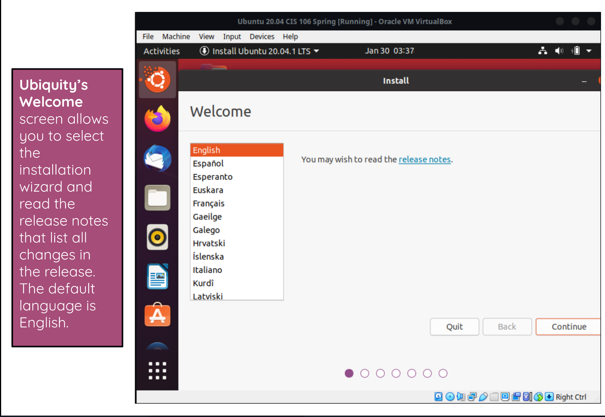

## Connecting Ubuntu to the internet
If you have a wireless-enabled computer, you can connect to a wireless network that is within range to get access to the internet, view shared files on the network, and so on.

Open the system menu from the right side of the top bar.

Select Wi-Fi Not Connected. The Wi-Fi section of the menu will expand.

Click Select Network.

Click the name of the network you want, then click Connect.

If the name of the network is not shown, scroll down the list. If you still do not see the network, you may be out of range, or the network might be hidden.

If the network is protected by a password (encryption key), enter the password when prompted and click Connect.

If you do not know the key, it may be written on the underside of the wireless router or base station, or in its instruction manual, or you may have to ask the person who administers the wireless network.

The network icon will change appearance as the computer attempts to connect to the network.

If the connection is successful, the icon will change to a dot with several curved bars above it (). More bars indicate a stronger connection to the network. Fewer bars mean the connection is weaker and might not be very reliable

## Every day tasks In Ubuntu
### Internet browsing
A web browser is a type of software that allows you to find and view websites on the Internet. Even if you didn't know it, you're using a web browser right now to read this page! There are many different web browsers, but some of the most common ones include Google Chrome, Internet Explorer, Safari, Microsoft Edge, and Mozilla Firefox.

#### Firefox

the Firefox app allows you to browse the web, open multiple tabs, conduct searches, and more. You'll even have the option to sign in to Firefox on your mobile device, allowing you to sync bookmarks, saved passwords, browsing history, and settings across all of your devices.
#### Alternatives

* Google Chrome: Google Chrome is a free web browser developed by Google, used for accessing web pages on the internet.
* Download deb package from here: https://www.google.com/chrome/downloads/
* Install deb package with gdebi, apt ,dpkg, or software center 
* To install with apt use: sudo apt install "absolute path of debpackage"
* To install with software center , double click the pakage.

### Reading email
reading the whole email and following directions, it will save a lot of stress and hassle for you, your agent, and the client. To avoid any complications, awkward situations, or miscommunication.

### Mail Spring

Mail spring is free for Mac, Windows, and Linux! However, if you use features like Snooze, Send Later, Send Reminders and Read Receipts often, you'll need to purchase a subscription to Mail spring Pro within the app.
#### Alternatives
* Mozilla thunderbird
* k mail
* claws-mail
### Remote assistance

Remote assistance refers to a connection that is intended to provide technical support from a distance. In this mode, a user who is sitting at his or her computer can invite a technician to see what is happening on the screen remotely.
#### Alternatives
* Windows Remote Assistance
* Quick Assist
* Team Viewer 

### Office productivity (writing documents, editing spreadsheets and doing presentations)

Office productivity tools are applications that allow for the viewing, creating and modifying of general office documents (e.g. spreadsheets, memos, presentations, letters, personal database, form generation, image editing, etc.).Office productivity tools also include applications for managing employee tasks.
#### Alternatives
* Google G Suite (Web, Android, iOS)
* Microsoft Office 365
* Google Doc 

### Streaming music and video

YouTube is by far the largest and most popular resource for online music videos. There's a huge number of official music videos that you can watch for free, as well as a plethora of user-made videos that cover every conceivable topic.
#### Alternatives 
* Netflix
* Hulu
* Disney+
* YouTube 

### Video games

a game played by electronically manipulating images produced by a computer program on a television screen or other display screen.
#### Alternatives 
* Install game on PlayOnLinux
Start PlayOnLinux > the big Install button at the top >
Install a non-listed program (at the bottom left of the window).
Select next on the wizard that appears.
Choose the option to “Install a program in a new virtual drive” and then Next.
Type a name for your setup.
* Jethook
* Proton and WINE
  

### Video Chatting/calling/conferencing

Here are some of the most commonly used video conferencing equipment: Displays: laptop, desktop monitor, television screen. Microphones and cameras: built-in microphones and webcams, USB microphones and webcams. Speakers: built-in computer speaker, external speaker, VoIP (voice over IP) conferencing phone.
#### Alternatives 
* whats app 
* Zoom
* Google Hangouts
* TrueConf Online
* FreeConference
* Slack Video Calls

### Texting/Instant messagi

Text messaging and instant messaging are similar because they are both used to send text messages. However, text messaging ("texting") uses the cellular phone service, whereas instant messaging employs the Internet. Text messages are typically limited to 160 characters, but instant messages can be longer.
#### Alternatives 
* Messenger 
* Whats App
* We Chat
* Telegram 

### Programing
In computing, a program is a specific set of ordered operations for a computer to perform. In the modern computer that John von Newman outlined in 1945, the program contains a one-at-a-time sequence of instructions that the computer follows. Typically, the program is put into a storage area accessible to the computer.
#### Alternatives 
How TO Write python in Linux:  Open a terminal window and type 'python' (without the quotes). This opens python in interactive mode. While this mode is good for initial learning, you may prefer to use a text editor (like , Vim or Emacs) to write your code. As long as you save it.
If you just want to write simple code like print('Hello world!') , you can use the python interpreter by typing python in the Terminal. The python interpreter lets you write and execute code line by line. 
* Python 
  
### Educational Applications (dictionaries and that kind of stuff)

Wordreference Dictionary
If you're learning a foreign language, WordReference—with its whopping 18 languages—is truly the holy grail of free dictionaries. Not only does it provide translations, it also offers definitions in the target language and helps you navigate those tricky conjugations.
#### Alternatives 
Merriam-Webster Dictionary
Oxford English Dictionary
Google Dictionary
Collins Dictionary
Cambridge Online Dictionary
Urban Dictionary
### How to get help with your Ubuntu machine
This is the command which is used for listing all possible commands that are pre-installed in Ubuntu. Launch the terminal by pressing Ctrl+ Alt+ T or just click on the terminal icon in the task bar. Simply type help in the terminal and press enter key.
#### Alternatives

Use -h or –help option of the command itself. ... Using apropos to search man pages. Use apropos to search man pages for available Unix commands on a specific functionality.

## Sources
* https://help.ubuntu.com/stable/ubuntu-help/net-wireless-connect.html.en
* https://edu.gcfglobal.org/en/internetbasics/using-a-web-browser/1/
* https://www.google.com/search?channel=fs&client=ubuntu&q=+Streaming+music+and+video 
* https://en.wikipedia.org/wiki/Video_game 
* https://www.google.com/search?channel=fs&client=ubuntu&q=+Texting%2FInstant+messaging
*https://opensource.com/article/21/2/linux-gaming 