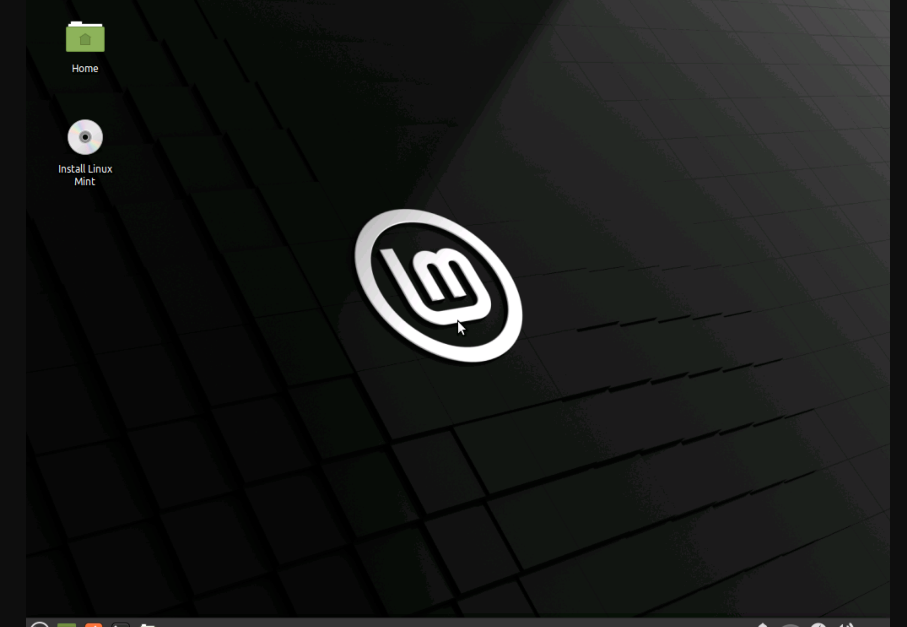

# Lab 1 Exploring Linux distributions
## Question 1
1. What is the OS Type: **Liunx** 
1. Which major distro is it based on? **Debain**
3. Which processor architecture does it support? **armhf,ppc64el,riscyv,s390x,x86_64**
4. Is the distribution active or is it discontinued? **active**
5. What is the distro’s home page? **GNOME,Untity**

## Question 2
1. What is the name of the distribution and the OS Type: **Lunux**
2. Which major distro is it based on? **Debin**
3. Which processor architecture does it support? **x86_64**
4. Is the distribution active or is it discontinued? **active**
5. What is the distro’s home page? **Xfce**

## Question 3
1. What is the name of the distribution? **Lunux**
2. What is the country of Origin? **Netherlands**
3. What major distribution is it based on? **Arch**
4. What is the distribution category? **Desktop,Live Medium**
5. Which processor architecture, aside from the one in the original query, does the OS support? **Budgie,Cinnamom,Gnome,i3,Kde plasma,LXQT,MATE,Xfce**
   
## Question 4
### A Linux distribution used for Data Rescue/Data recovery
| Distro Name	  |   Website	                |    Desktop Environment      |
                                                                            
|  **ALT Linux**  |**https://en.altlinux.org/** |  **AfterStep,Blackbox,      |

### A Linux distribution used for Education that supports the ix86 processor 
| Distro Name	|   Website	         |    Desktop Environment                                                                                    |
| **lNixOS**     |**http:nixos.org/** |**Awesome,Enligtenment,Flutbox,GNOME,i3,IceWM,KDE PLasma,**|
                                                                                                                 

### A Linux distribution that supports the OEM installation method
| Distro Name	|   Website	 |    Desktop Environment   |
|               |            |                          |
|               |            |                          |

## Question 5
get experience with, some of the system level interfaces provided in Linix.
operating system have many interesting dark corners, and a chance to peek around one of them.

## Question 6

