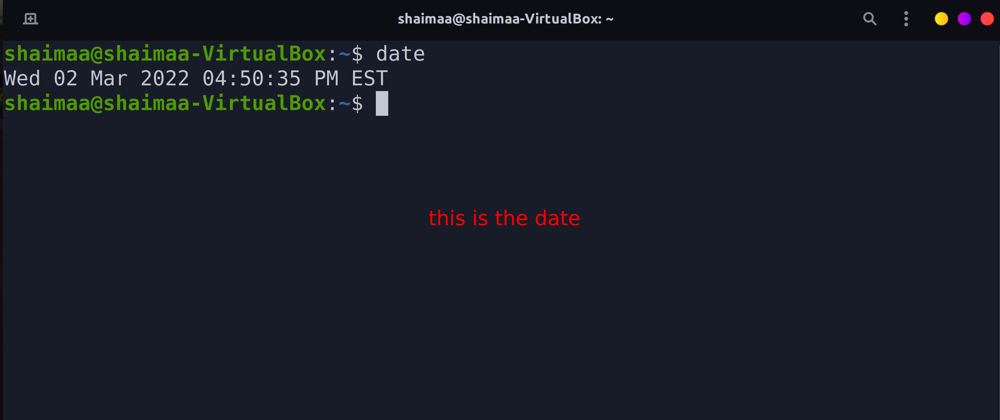

...
Name: shaimaa husien
class: cis106
semester: spring 22
...
 
# lab 3 Usieng Ubuntu
 
 
# Question 1

 
# Question 2

# Question 3
 
| Program purpose     | Package Name  | Version         | Description                      |
| ------------------- | ------------  | -------         | -----------                      |
| Play a tetris game  | quadr passet  |3.36.0.1         | tetris game                      |
| Play a video file   |totem          |3.34.1-2         |  video file                      |
| Browse the internet |streamtuner2   |2.2.1+dfsg-2     |Browser for internet              | 
| Read your email     |lbdb           |0.48.1 amd64     | mail reader                      |
| Play music          |clementine     | 1.4.0~rc1+dfsg-1|music player and library organizer|
 
 
# Commands Answers:
* Sub Question 1:apt install
* Sub Question 2: apt remove
* Sub Question 3: apt aout remove
 
 
# Question 4
| command | what it does                                                 |
|---------|--------------                                                |
| echo    |display a line of text                                        |
| fortune |print a random, hopefully interesting, adage                  |           
| cowsay  |cowthink - configurable speaking/thinking cow (and a bit more)|            
| lolcat  |rainbow coloring for text                                     |
| figlet  |No manual entry for figlet                                    |
| toilet  |display large colourful characters                            |
| rig     |Random Identity Generator                                     |

