# Lab 4 the Linux fs

## Question 1
## Table 1

| Directory | Function                                                                        |
| --------- | ------------------------------------------------------------------------------- |
| bin       | directory contains binaries for use by all users.                               |
| dev       | the location of special or device files.                                        |
| etc       | is where a Linux system's configuration files live.                             |
| home      | directory for a particular user of the system and consists of individual files. |
| opt       | reserved for the installation of add-on application software packages.          |
| proc      | is virtual file system created on fly when system boots.                        |
| srv       | directory contains site-specific data served by your system running Red Hat.    |
| usr       | referred to as a process information pseudo-file system.                        |

## Table 2

 | Command | What it does                                  | Syntax             | Example       |
 | ------- | --------------------------------------------- | ------------------ | ------------- |
 | pwd     | displaying the current working directory      | pwd                | /home         |
 | cd      | changing the current working  directory       | cd name/Documents/ | ~/Documents/$ |
 | ls      | displaying all filed inside a given directory | ------------------ | ------------- |

## Screen shots 

 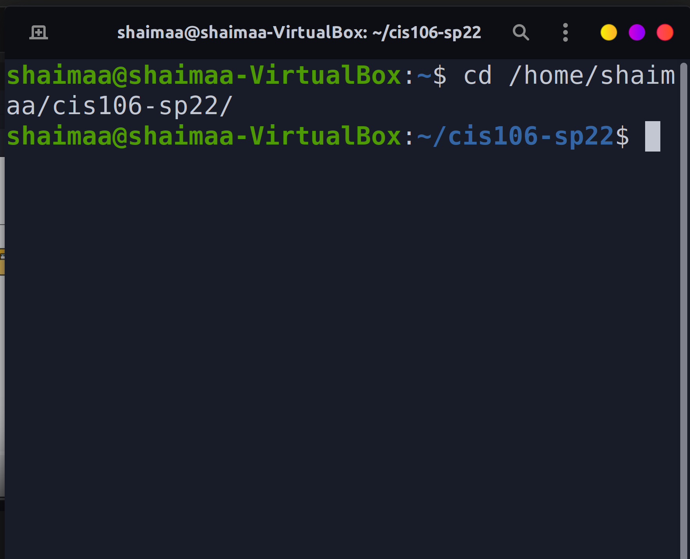
 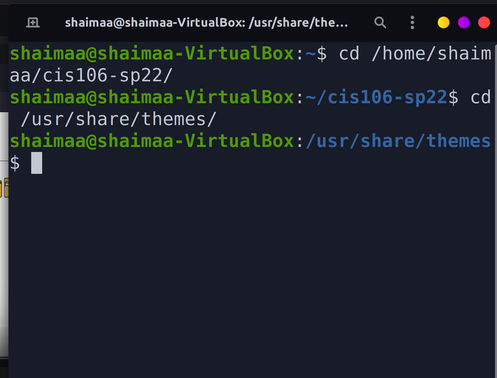
 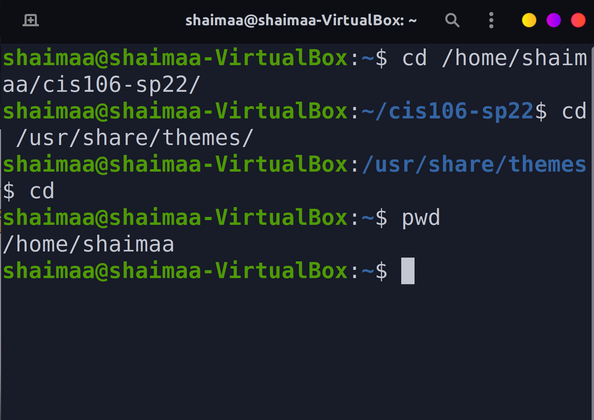
 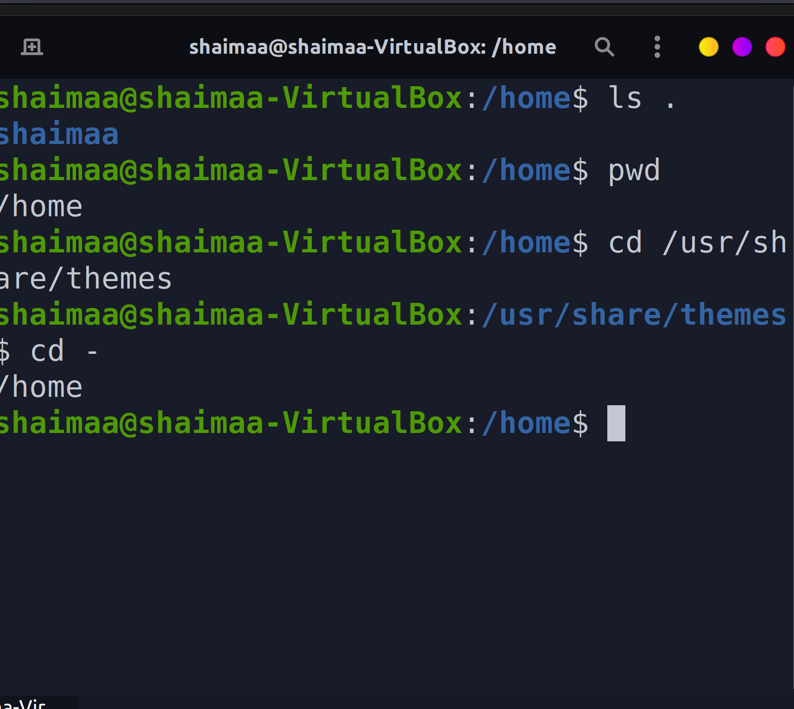
 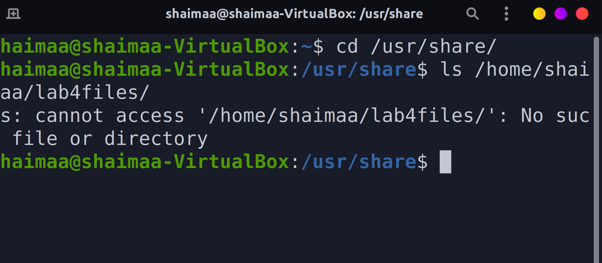

## Question 2 
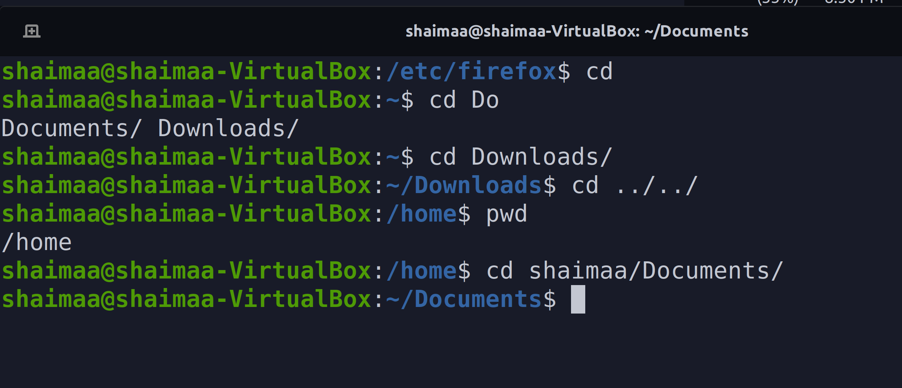
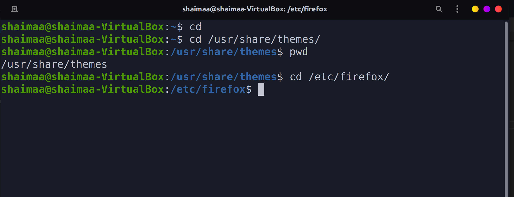

## Question 3
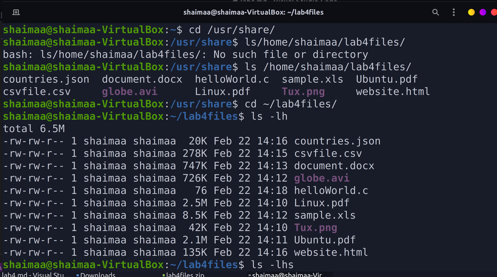
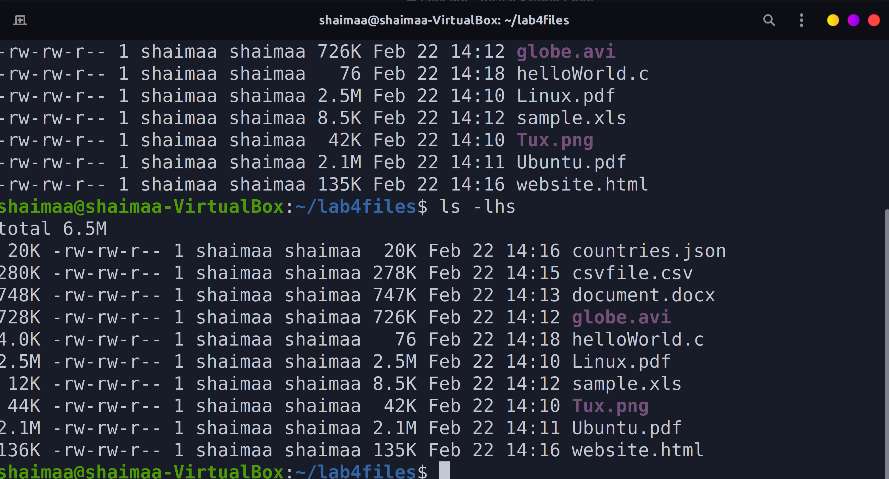
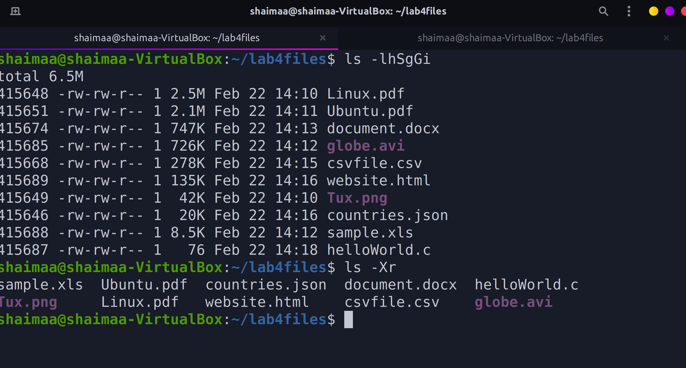

## Question 4
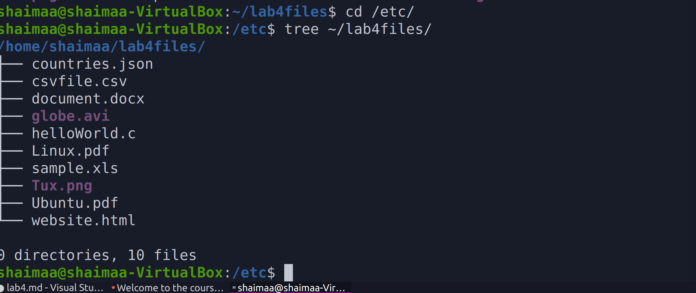
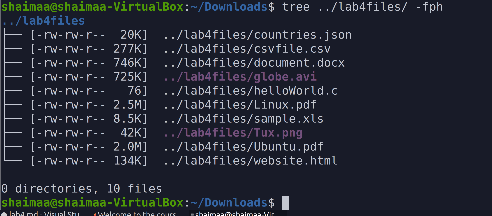
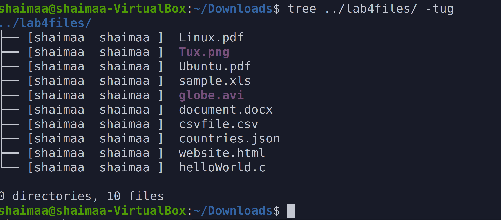
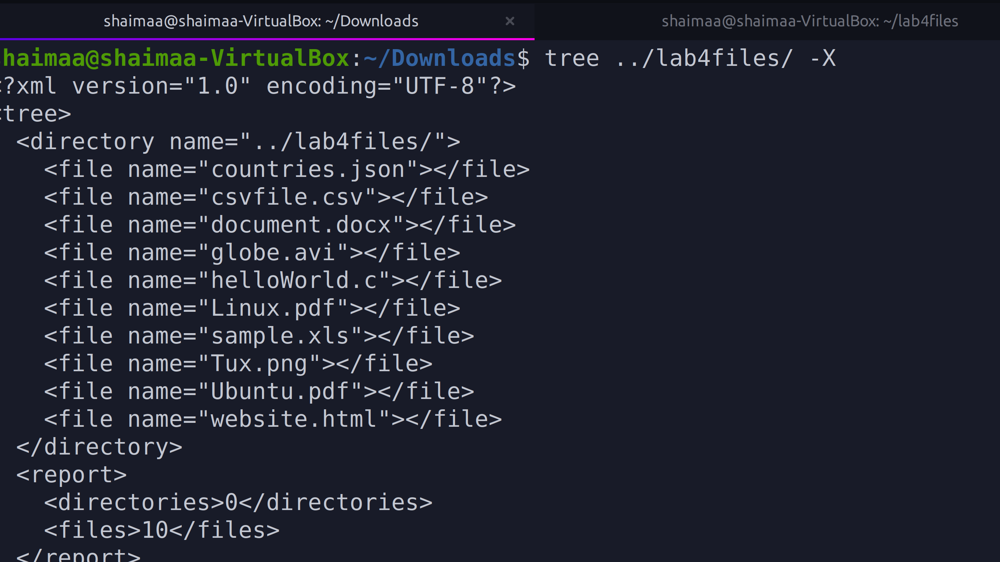
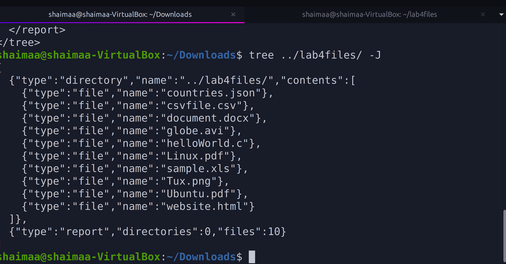
## Question 
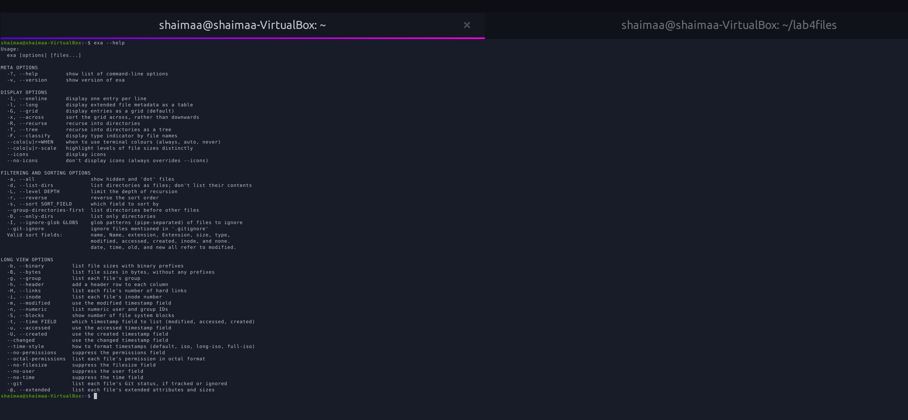
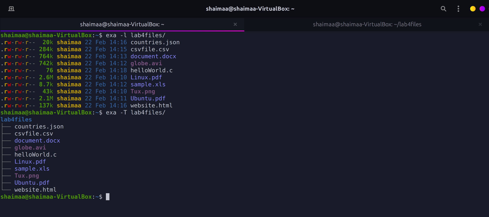
![q5.3](q5.3.png

