# Lab 7 - Handling Files
* Name: Shaimaa 
* Class: CIS106
* Semester: Sp 2022

# Question 2: cut 
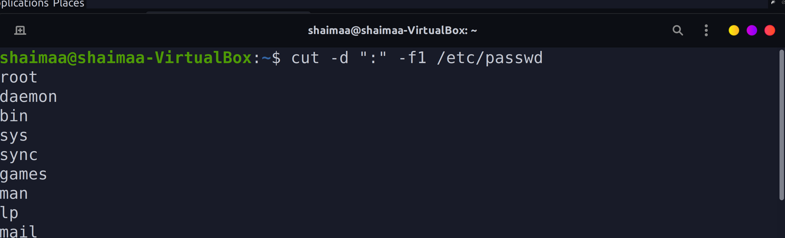
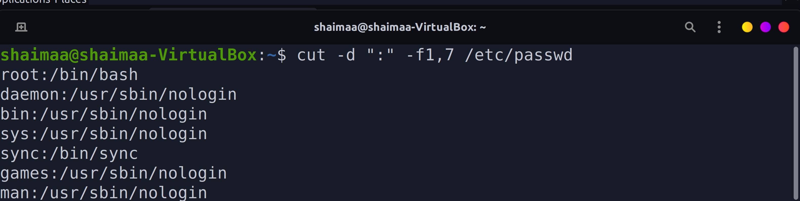
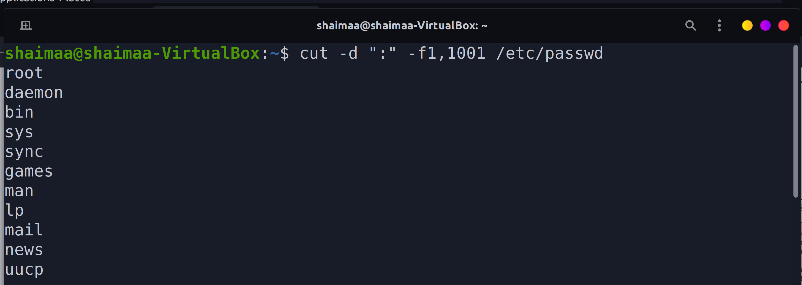
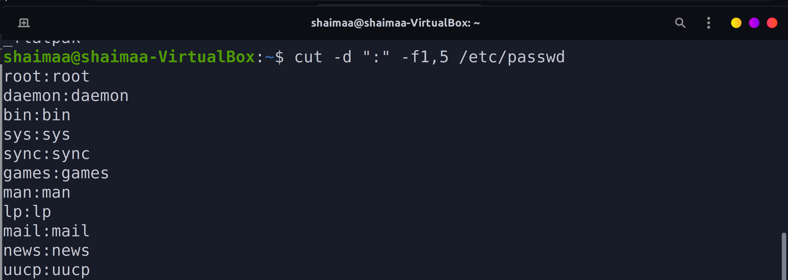

# Question 3 Paste, wc
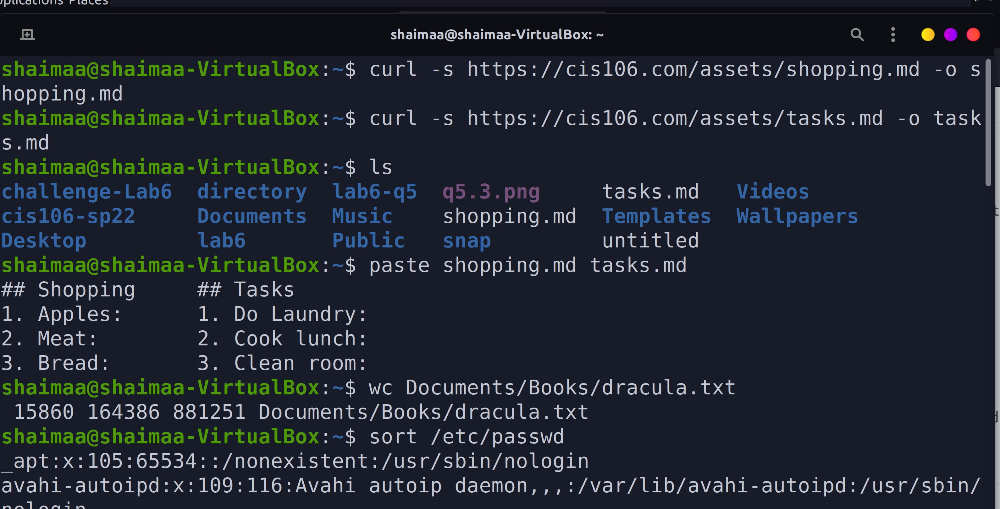

# Question 4 tr, grep 
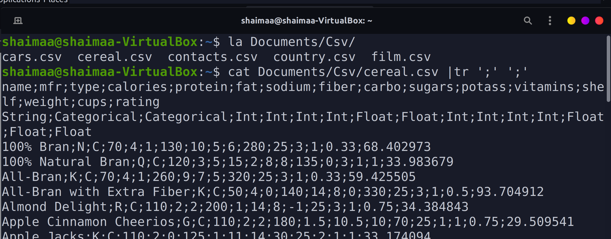
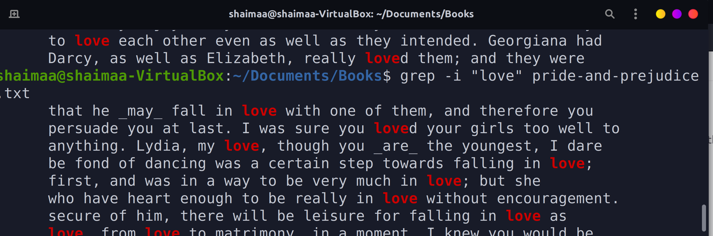
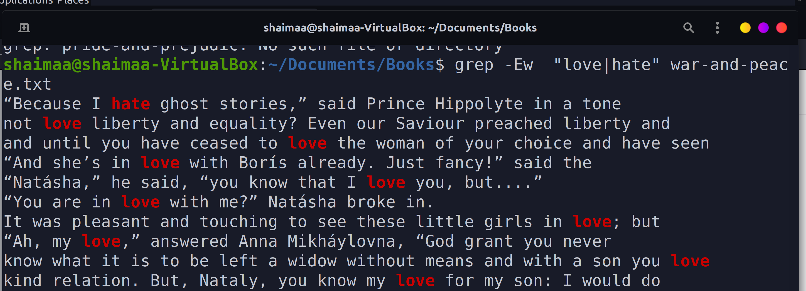

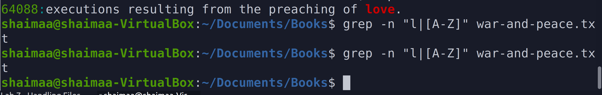

# Question 5 awk and sed 
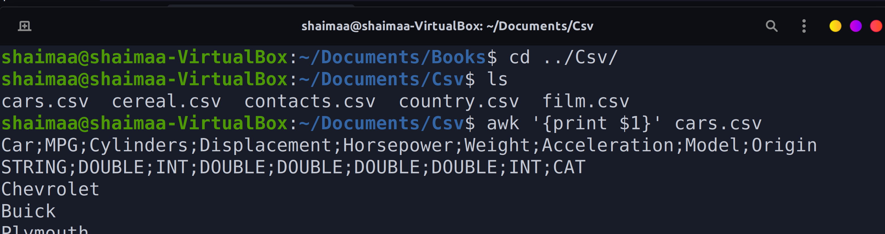
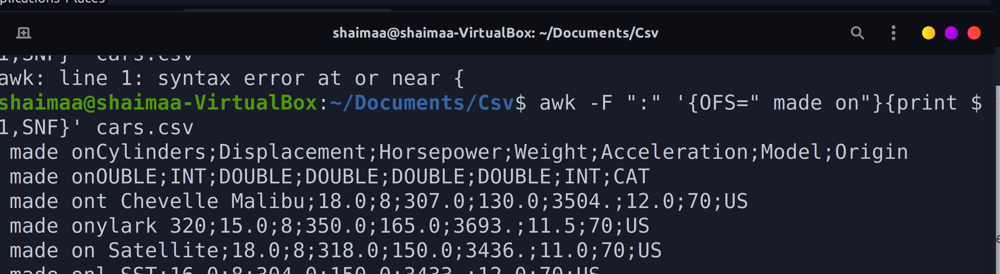
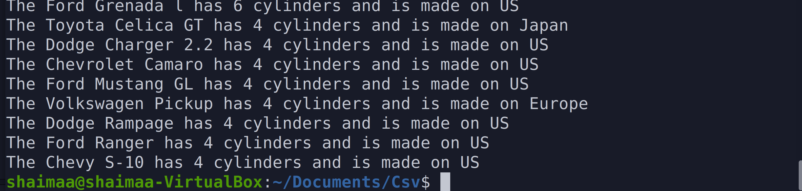
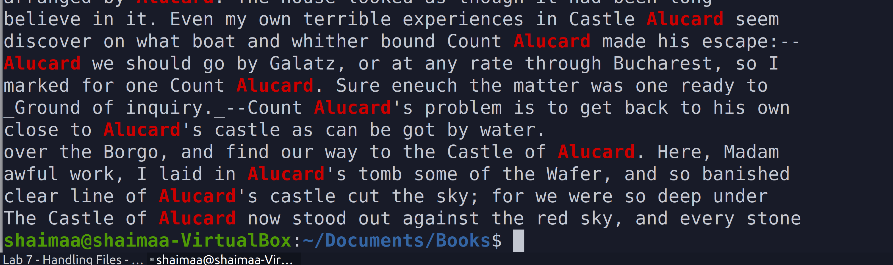

# Question 6 I/O Redirection 
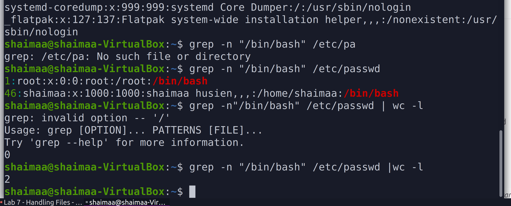
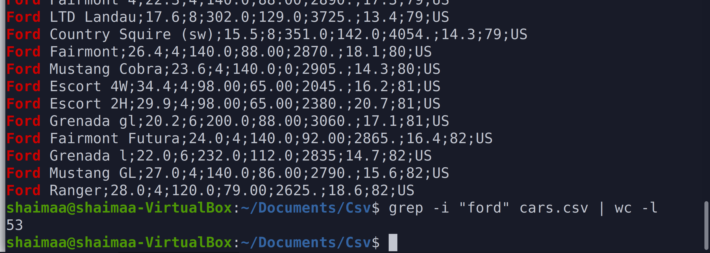

