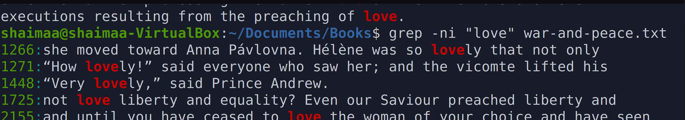

# Lab 7 - Handling Files
* Name: Shaimaa 
* Class: CIS106
* Semester: Sp 2022

# Question 2: cut 

# Question 3 Paste, wc

# Question 4 tr, grep 

# Question 5 awk and sed 

# Question 6 I/O Redirection 

