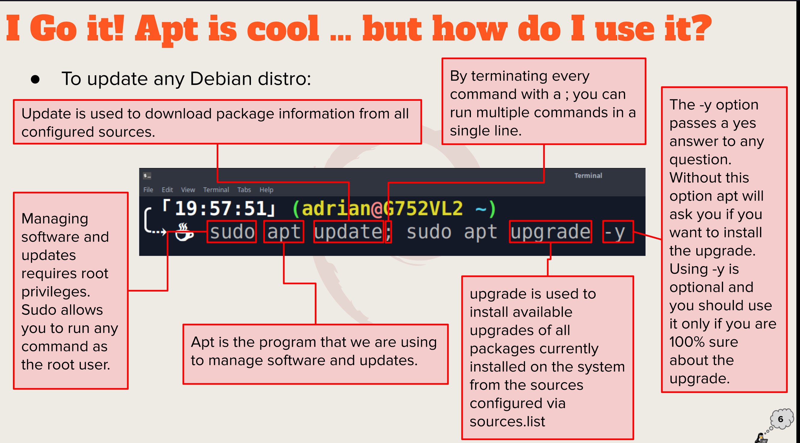
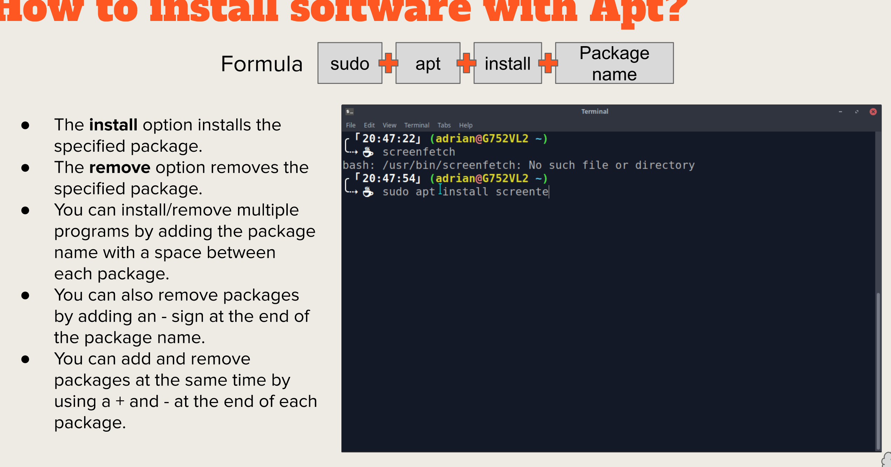
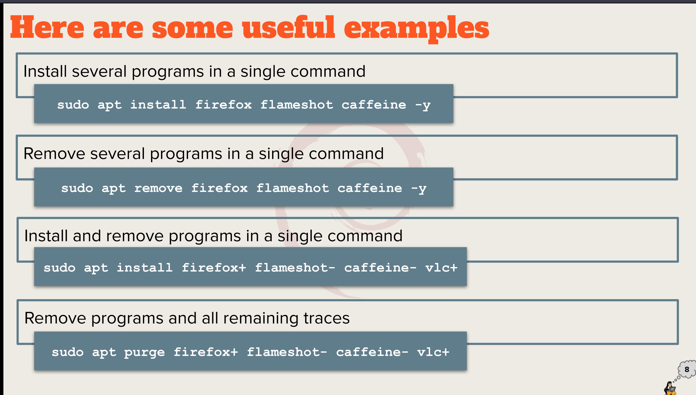
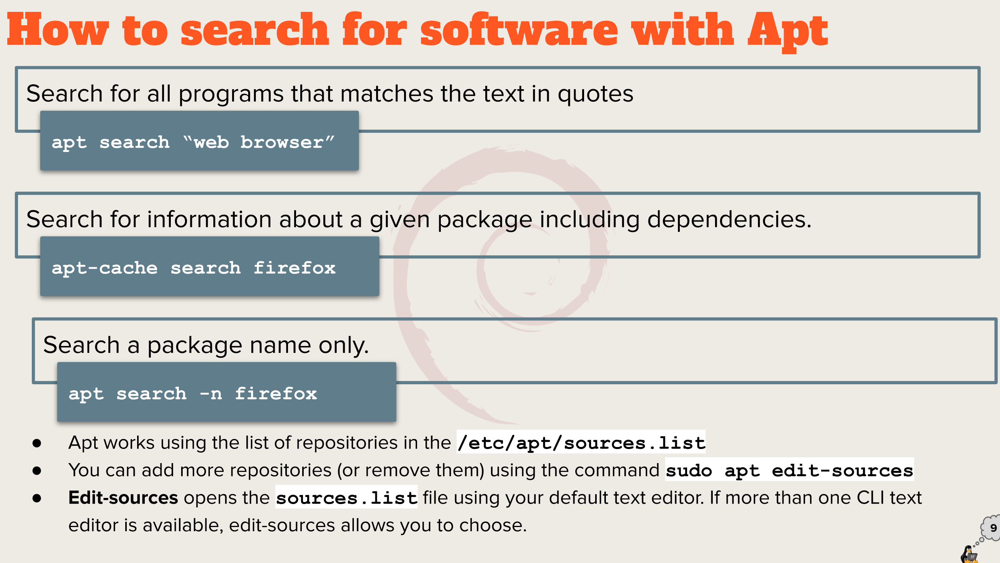
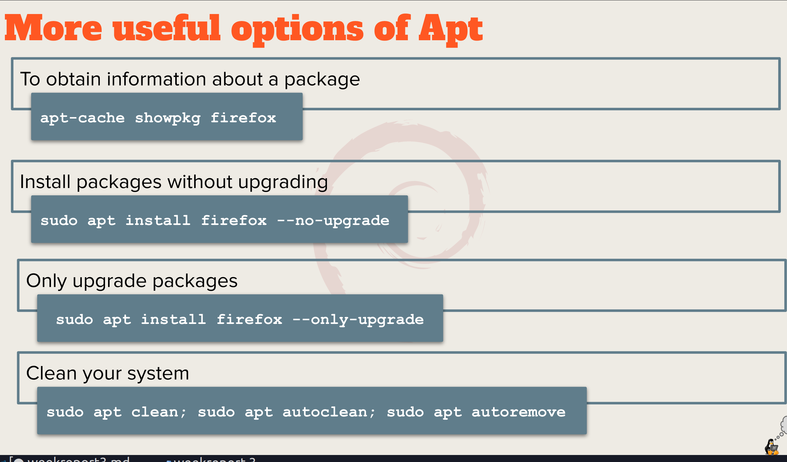
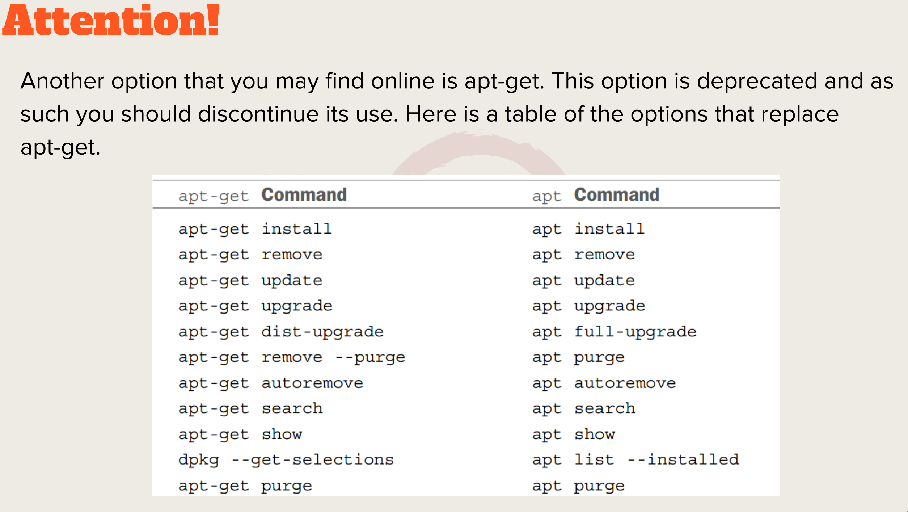
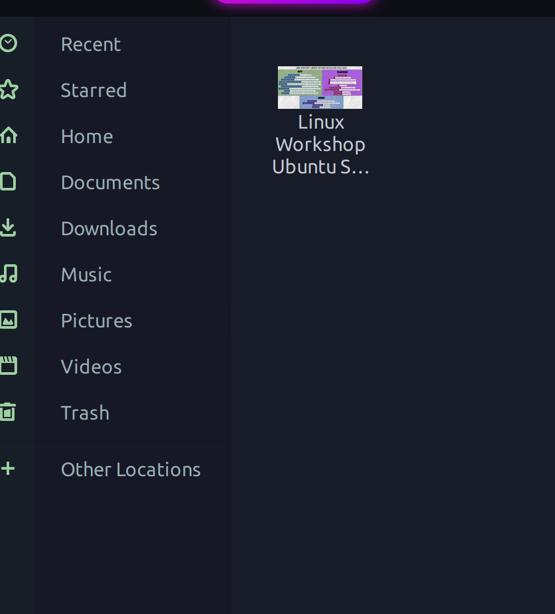

# week report 3 
  
   # Summary of presentations
   Basic Terminologygit push
   package archives that contain binaries of software coffi gurtion
   files name and information
   library. reusable code that can be used by more than one function or program.
   Dependency software needed as foundation for other software.
   Repository. 
      Settings
      Search
     Settings at a glance
     Launcher
     App Library
     Dock
     Panel
     Compositor
 
          # bulleted list of different desktop environments
 
           KDE is one of the most popular desktop environments out there. You may also refer it as the “Plasma” desktop.MATE Desktop Environment is based on
            GNOME 2. MATE was initially developed for the users who were disappointed with the latest iteration of GNOME shell — GNOME 3. Ubuntu MATE is one
            of the official flavors of Ubuntu that utilizes the MATE desktop. Some other popular Linux distributions like Linux Mint, Manjaro, etc, also offer
            MATE editions of their distributions.
 
          # Definitions for the following terms: GUI, DE
 
           GUI:A graphical user interface is a from of user interface that allows use electronic systems via icons, windows and
           various other visual elements.
           DE;In computing, the desktop is an embodiment of the desktop parabole program running on top of a computer operating system that shares a
           described as a graphical shell.
 
           Bulleted list of the common elements of a desktop environment
           .GNOME
           .KDE
       The bash Shell
 
           What is a shell?
           A shell is a layer of computer program which exposes an operating system service and other.
 
           # List different shells
            -Tcsh shell
            -Csh shell
            -Ksh shell
            -Zsh shell
            -Fish shell
 
           # List basic commands and their usage
            .date: displays the current time and date. 
            .cl:   calender of the current month.
            .df:   the current amount of free space on the disk drives.
            .free: the amount of free memory. 
            .uname: information about the  system.
            .clear: clear the screen.  
        

           # List some bash shortcuts ?
           .CTRL+A :go to the beginning of the line.
           .CTRL+E : Go to the end of the line.
           .CTRL+B : Go to the left(back) one character.
           .CTRL+F : Go to the right(forward) one word.

 
       Managing Software
           Command for updating ubuntu
           sudo apt update: sudo apt update -y
 
           Command for installing software
           sudo apt install package name
 
           Command for removing software
           sudo apt remove firefox foreshow caffeine-y
 
           Command for searching for software
           apt search"web browser"
 
           Definition of the following terms:
               Package . archives that contain binaris of software ,configuration files, and information.
               Library . reusable code that can be used by more than one function or program.
               Repository. a large collection of software available for download.
              
           # Include the screenshot of how to update ubuntu with its explanation (page 6)
           ![]
 
In your repository create a folder for cheat sheets and place here the installing software

 cheat sheet, and markdown cheat sheet.

