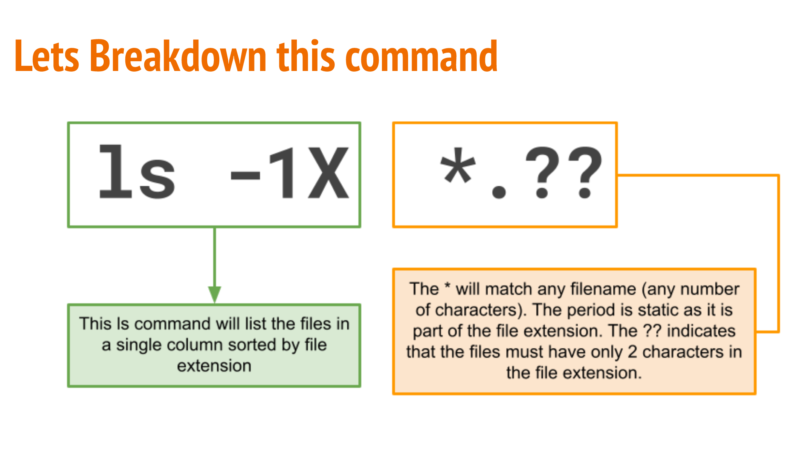
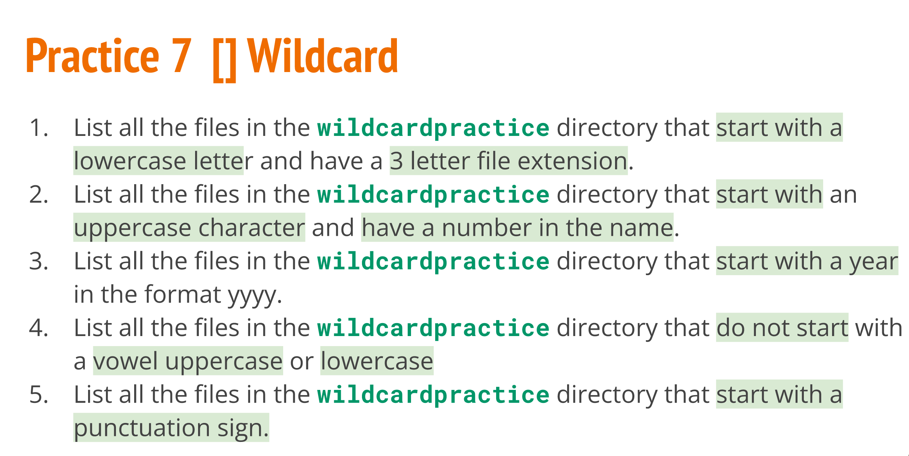

# Week Report 6

## Wildcards
* WildCard represents letter and characters used to specify a file name for searches.
* File gobbing is the processing of pattern matching using wildcards.
* The wildcard are officially called metacharacter wildcard.

## Example 
* you can use a wildcard to get a long list of all files in the current directory starting with "new"
* Use wildcards to manage to directories faster 
* Locate files based on a portion of their filenames 
* create files and directories quicker

## Brace expansion and how to use it
* Brace expansion {}is not a wildcard but another feature of bash that allows you to generate 
arbitrary strings to use with commands.
* For example,
* * to create whole directory structure in a single command:
` mkdir -p music/{jazz,rock}/{p3files,videos,oggfiles}/new{1..3} `
* To create N number of files use:
` touch website{1..5}.html`
` touch file {A..Z}.txt`
` touch file {001..10}.py`
` touch file {a..z},{0..10}}.js`
* Remove multiple files in a single directory
` rm -r {dir1,dir2,dir3,file.txt.py}`

